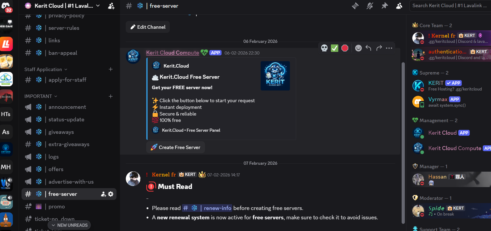
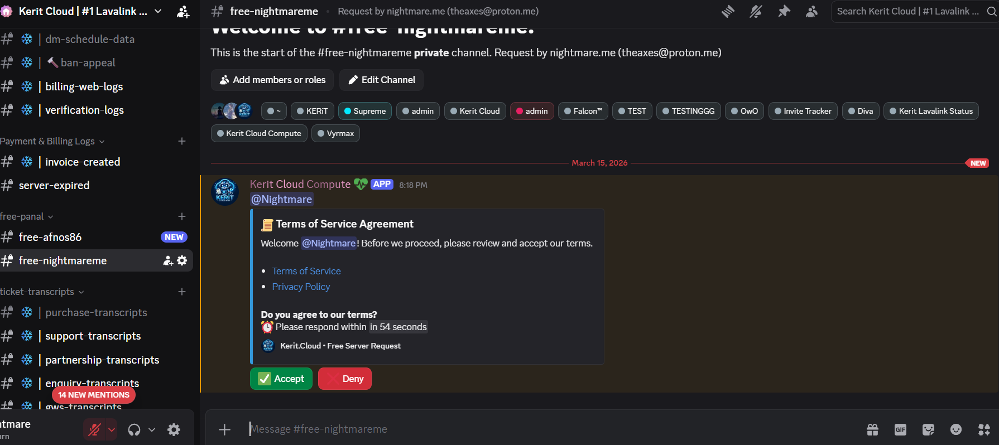
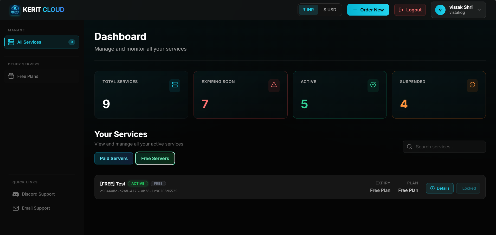
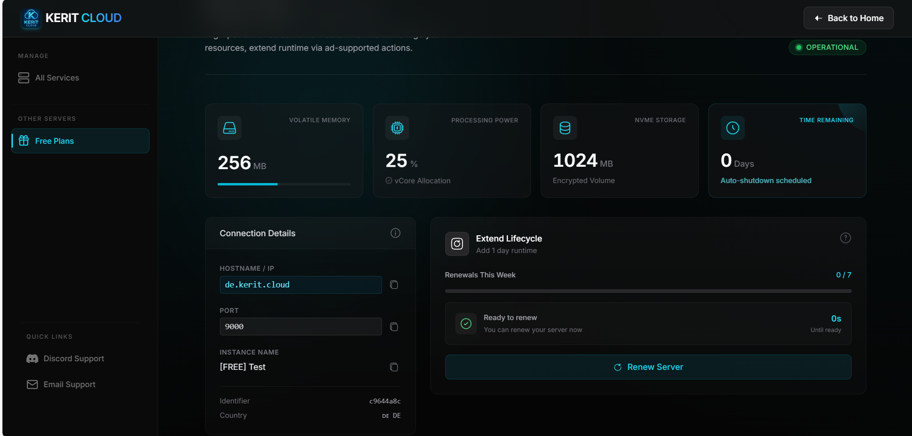
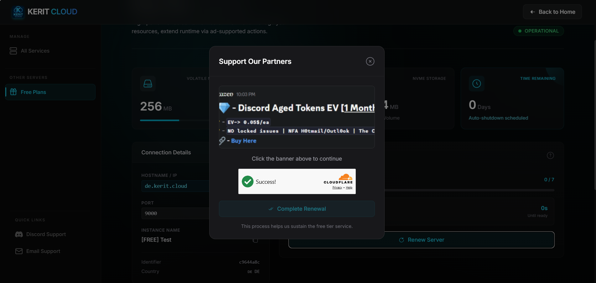
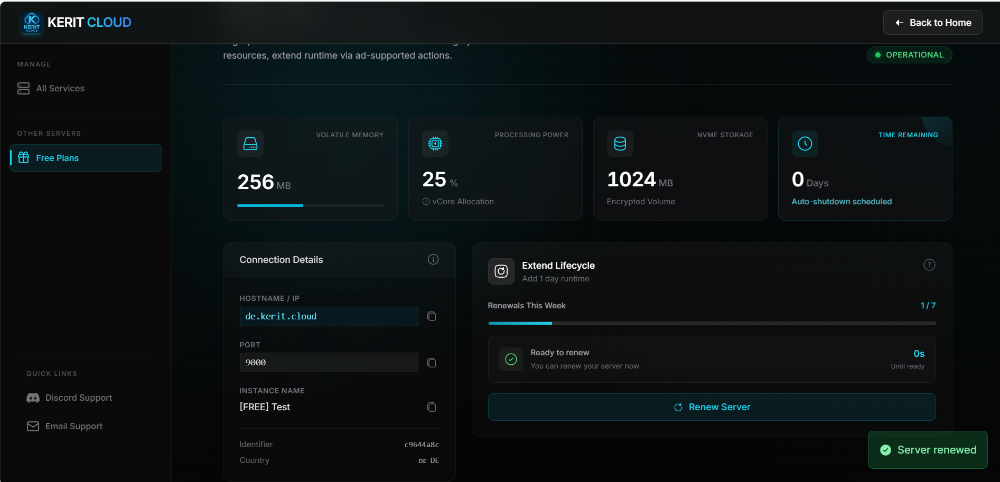

# Free Bot Hosting on Kerit Cloud — Full Guide - truly free forever

Welcome to **Kerit Cloud Free Tier**! This guide walks you through claiming, managing, and renewing your free server for testing small bots and scripts.  
Kerit Cloud offers the best free Discord bot hosting, providing instant setup, daily renewal, and a lightweight server optimized for Python and Node.js bots.
developers trust Kerit Cloud to host their free bots with zero downtime and full visibility of CPU, RAM, and storage stats from an intuitive pane
---
---

  
  
  
  
  

## 1️⃣ Quick Start: Claim Your Free Server
Claim your free Discord bot server today — one per user — and start running Python or Node.js bots in seconds with automatic daily renewals
1. Join our Discord server: [Kerit Cloud Discord](https://discord.gg/7x9MQgFrCT)  
2. Go to the official free server channel: [Free Server Channel](https://discord.com/channels/1430601018751844436/1433403630106447952)  
3. Follow the instructions to claim your free server.  
4. Once created, your server will automatically appear in your [billing panel](https://billing.kerit.cloud) and [console](https://panel.kerit.cloud).  

**💡 Tip:** Only **one free server per user** is allowed.

Kerit Cloud delivers uninterrupted, never-down, free Discord bot hosting with instant server creation, zero-latency Python/Node.js support, full resource visibility, automated daily renewals, and a premium hosting experience without paying a dime.
---

### Walkthrough

1. **Locate Free Server Channel on Discord**  

2. **Create a request for a free server** by clicking the "Create Free Server" button  

3. **Fill in your Email, Server Name, and Source** (where you found us).  
   - Make sure you are registered on [panel](https://panel.kerit.cloud/auth/register) before creating a request.  
   - Click **Submit** when done.

4. **Agree to Terms of Service**  
   - A request channel gets created, asking if you agree to our [TOS](https://kerit.cloud/tos).  
   - Click **Agree** to continue.  

5. **Select Programming Language**  
   - The bot will ask which programming language you want: **Python** or **Node.js**.  
  

6. Click the programming language you want for your hosting server.  

7. The bot asks for **final confirmation** of your submitted information. Press **Correct** to continue.  

8. **Email Verification**  
   - Check your inbox for the email "Free Server Verification" (may appear in spam/junk folder).  
   - Open it and complete verification.  
  

9. Once verification is completed, within a few seconds your hosting server is created.  
   - You will receive a **DM from the bot** and an **email notification** confirming creation.

10. **Access your free server**  
    - Go to your [panel](https://panel.kerit.cloud) to manage it.

---

## 2️⃣ Access and Manage Your Server

Visit your billing panel: [Kerit Cloud Billing](https://billing.kerit.cloud) and log in with your email or Discord.

- Open **Free Server** to access the instance dashboard  
- Monitor **RAM, CPU, Storage, Time Remaining, and Renewal status**  

**Screenshot – Billing Panel Overview:**  
  
*Click on "Free Plans".*

**Screenshot – Free Server Panel Overview:**  
  
*Overview of your free server dashboard with resource stats and connection details.*

---

## 3️⃣ How Server Time Works

- Servers run on a **daily timer**  
- **1 day reduced every 24 hours**  
- **1 renewal becomes available every 24 hours**  
- **Max 7 renewals per week**  
- If **time reaches 0 days** without renewal → server **auto-stops**  

---

## 4️⃣ How to Renew (+1 Day Runtime)

**Step-by-step renewal:**  

1. Click **Renew Server** inside the Free Server panel  
2. Click the **promotional banner**  
3. Complete **Cloudflare verification**  
4. Click **Complete Renewal** → adds +1 day instantly  

**Screenshot – Renewal Dialog Pending Verification:**  
  
*Verification incomplete. User must click banner and complete CF verification.*

**Screenshot – Renewal Successful:**  
  
*Confirmation showing that renewal was successful.*

**💡 Tip:** Renewal is **instant**, no server restart or data loss occurs.

---

## 5️⃣ Panel Overview

Inside the Free Server panel, you can see:

- **Time Remaining** (days)  
- **Renewals This Week** (x / 7)  
- Countdown until **next renewal** is available  
- **Connection details:** IP, Port, Name  
- **Live resource stats**  
- **Server location**

---

## 6️⃣ Rules & Restrictions

- Only **one free server per user**  
- Must **renew at least once per day**  
- **Unused renewals do not stack** beyond weekly limit  
- Allowed: **small Discord bots, Python/JS scripts**  
- Not allowed: **Minecraft, Java servers, Lavalink, rule-breaking code**  

⚠️ **Abuse may lead to permanent account suspension.**

---

## 7️⃣ Want More Power?

Free tier is for **light testing workloads**.  

Upgrade to paid plans for:

- Dedicated CPU, higher RAM, backups  
- Lower latency & 99.9% uptime  
- Priority support  

Available inside the panel under **Upgrade to Paid Plans**.

---

## 8️⃣ FAQ Highlights

**Q:** It says I already have a free server.  
**A:** Only **one free server per user** is allowed. Multiple attempts may result in **permanent suspension**.  

**Q:** What can I run on a free server?  
**A:** Small bots and scripts only. Heavy workloads like Minecraft, Lavalink, or Java servers are **prohibited**.  

**Q:** Is there any catch?  
**A:** Yes — you must **renew daily or once per week**, click the **sponsor banner**, and complete **Cloudflare verification**.

---

## ✅ Additional Tips

- Keep track of your **renewal countdown** to avoid auto-stop.  
- Free tier is perfect for testing, small bots, or scripts.  
- Use paid plans for production workloads or larger servers.  
- Stop wasting time on unreliable free hosts — Kerit Cloud gives you stable, free bot servers with clear resource monitoring and hassle-free daily renewals.
- Looking for free Discord bot hosting with Python/Node.js support, instant server creation, panel management, and full resource visibility? Kerit Cloud is your ultimate solution for lightweight, reliable, and zero-cost hosting.
---
## Topics

`discord-bot-hosting` `free-discord-bot-hosting` `free-bot-hosting` `discord-bot` `discord-bot-free` `discord-bot-24-7` `free-nodejs-hosting` `free-python-hosting` `free-java-hosting` `lavalink-hosting` `free-lavalink` `lavalink-node` `free-lavalink-hosting` `lavalink-discord` `discord-music-bot` `shoukaku` `wavelink` `lavaplayer` `discord.js` `discord.py` `pycord` `jda` `pterodactyl` `free-hosting` `kerit-cloud` `kerit-cloud-free` `kerit-cloud-bot-hosting` `kerit-cloud-lavalink` `kerit-cloud-discord-bot` `kerit-cloud-24-7` `kerit-cloud-nodejs-hosting` `kerit-cloud-python-hosting` `kerit-cloud-java-hosting` `kerit-cloud-music-bot` `kerit-cloud-shoukaku` `kerit-cloud-wavelink` `kerit-cloud-lavaplayer`
free bot hosting, Kerit Cloud, Discord server hosting, Python hosting, Node.js hosting, free server panel, free cloud serverlightweight bot server
